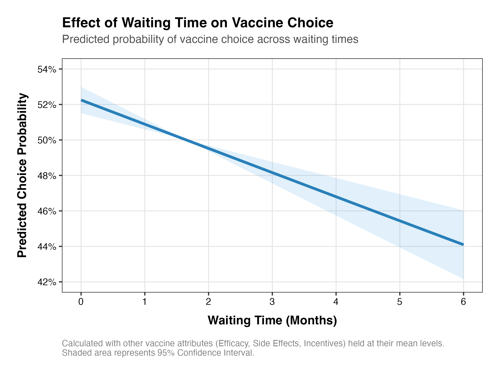
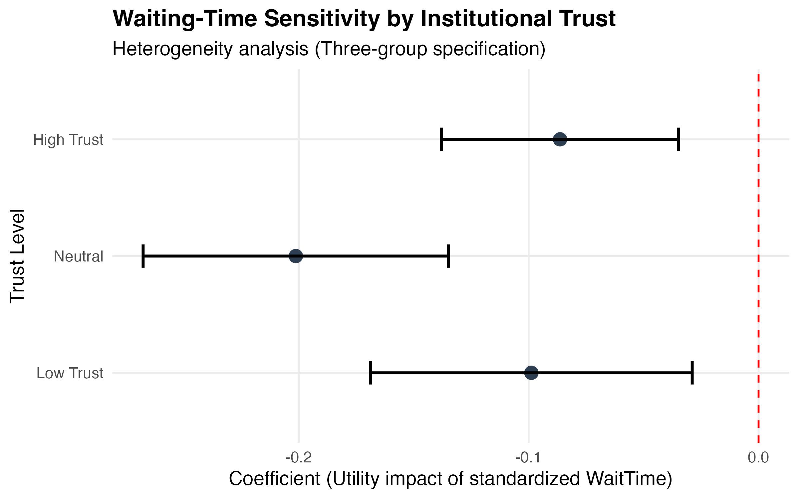

# How Waiting Time Shapes Preventive Health Behavior: Evidence from Vaccination Decisions

**Job Market Paper**  
**Author**: [Yichao Jin](https://yichao2022.github.io/) (University of Texas at Dallas)

[](https://yichao2022.github.io/)
[](LICENSE)

---

## 1. Motivation
The timing of vaccine uptake is a critical but under-explored dimension of epidemic control. While traditional models focus on *whether* people vaccinate, this paper investigates *when* they vaccinate. We define waiting time as a "behavioral tax" on public health implementation. By quantifying the trade-off between waiting time and financial incentives, we provide a structural framework to optimize the timing of preventive health interventions.

## 2. Key Contributions & Behavioral Insights
- **Structural Estimation**: Recovered behavioral discounting parameters using a Discrete Choice Experiment (DCE) on a large-scale representative sample.
- **MWTA Discovery**: Calculated the Marginal Willingness to Accept (MWTA) for reducing vaccination delay, finding significant heterogeneity across socioeconomic groups (Median MWTA ≈ 47 RMB/hour).
- **Policy Simulation**: Demonstrated how time-sensitive incentives can flatten the epidemic curve more effectively than flat subsidies.
- **Methodological Integration**: Combined structural behavioral modeling with SEIR epidemic simulations to quantify the welfare impacts of behavioral delay.

### 📊 Visualizing the Behavioral Friction
Waiting time significantly discourages vaccination uptake, but the "behavioral tax" varies by institutional trust and socioeconomic context:
- **Main Effect**: Waiting time acts as a major deterrent to vaccine uptake, significantly flattening the adoption curve.
- **Trust as a Buffer**: High institutional trust significantly mitigates the negative impact of wait time ($p < 0.05$ in the three-group specification).
- **Economic Value (MWTA)**: The median Marginal Willingness to Accept (MWTA) for reducing wait time is approximately 47 RMB/hour, with significant heterogeneity across trust levels.

<p align="center">
  
  
  
</p>

## 3. Repository Structure
```text
/models/              → Implementation of Structural Parameter Recovery and Mixed Logit models.
  - discount_estimation.R: Replicates the κ=0.225 finding (Hyperbolic vs Exponential fit).
  - logit_analysis.R: Main discrete choice modeling (Mixed Logit, Subgroups, MWTA).
  - seir_behavioral.R: SEIR epidemic simulation integrated with behavioral delay functions.
/data_simulation/     → Synthetic data generation and sample datasets
  - generate_synthetic_data.R: Creates a synthetic dataset mirroring original survey statistics.
/plots/               → Key result plots and visual summaries.
/results/             → Tabular outputs and parameter summaries.
/docs/                → Paper PDF (Job Market Paper) and methodology details.
data_access.md        → Explanation of restricted vs. synthetic data.
METHODOLOGY.md        → Deep dive into the Mixed Logit & MWTA logic.
```

## 4. Quick Replication (Main Results)
To replicate the parameter recovery logic using provided synthetic data:

1.  **Generate/Load Data**:
    `Rscript data_simulation/01_generate_synthetic_data.R`
2.  **Estimate Structural Model**:
    `Rscript models/01_validate_recovery.R`
3.  **Produce Figures**:
    `Rscript plots/01_generate_main_plots.R` (Note: Local directory is `plots/`)

## 5. Requirements
This project primarily uses **R**. Required packages:
- `mlogit` (for Mixed Logit estimation)
- `tidyverse` (for data manipulation)
- `ggplot2` (for visualization)

## 6. Data Availability
Primary experimental data are restricted due to privacy compliance. This repository provides a validated **synthetic dataset** that replicates the structural properties of the original sample. See [data_access.md](data_access.md) for details.

---

## 🎓 Citation

If you find this research or code useful, please cite:

```bibtex
@article{jin2026waiting,
  title={How Waiting Time Shapes Preventive Health Behavior: Evidence from Vaccination Decisions},
  author={Jin, Yichao and Kim, Dohyeong and Tian, Zhen},
  year={2026},
  journal={Working Paper},
  url={https://yichao2022.github.io/}
}
```

**Contact**: [Yichao.Jin@UTDallas.edu](mailto:Yichao.Jin@UTDallas.edu)
